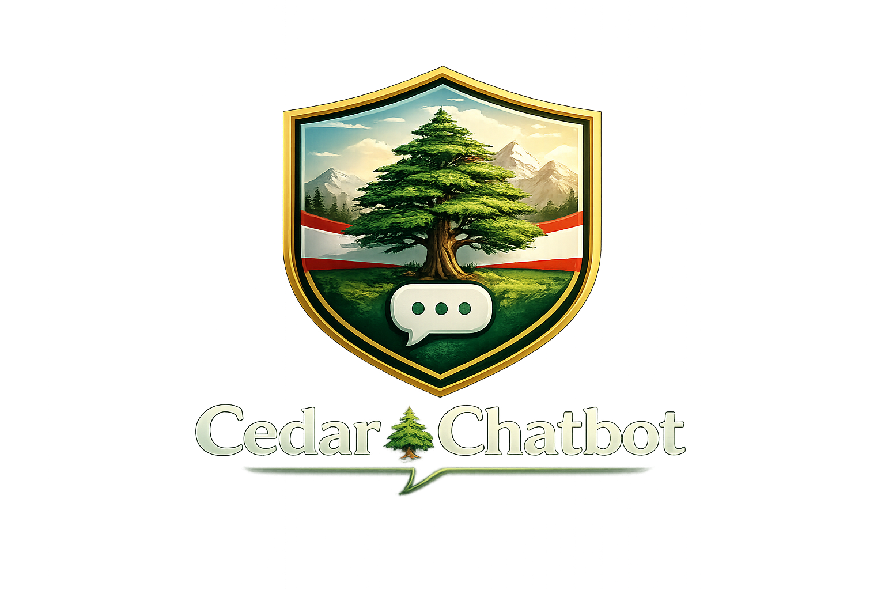

<p align="center">
  
</p>

<h1 align="center">🌲 Cedar Chatbot</h1>

<p align="center">
  <strong>A premium trilingual AI chatbot — English · Arabic · Lebanese dialect</strong>
</p>

<p align="center">
  
  
  
  
  
  
</p>

<p align="center">
  <a href="#-features">Features</a> •
  <a href="#-architecture">Architecture</a> •
  <a href="#-quick-start">Quick Start</a> •
  <a href="#-api-reference">API</a> •
  <a href="#-rl-feedback-loop">RLHF</a> •
  <a href="#-contributing">Contributing</a>
</p>

---

## 🎯 Overview

**Cedar Chatbot** is a production-grade, trilingual conversational AI system built for the Lebanese market. It combines state-of-the-art NLP with deep learning, reinforcement learning from human feedback (RLHF), and a full-stack deployment architecture.

Lebanese users frequently write Arabic using Latin characters (**Arabizi**):

```
keefak ya zalame? shu 3am ta3mel?
→ كيفك يا زلمة؟ شو عم تعمل؟
```

Cedar normalizes Arabizi into Arabic script, detects language/dialect, classifies intent, analyzes sentiment, and generates context-aware responses — all in real time.

---

## ✨ Features

### 🧠 NLP & Deep Learning
- **Transformer backbone** — `facebook/blenderbot-400M-distill` with fine-tuning support
- **Lebanese Arabizi normalization** — rule-based + learned transliteration (3 → ع, 7 → ح, 5 → خ, etc.)
- **Tri-language detection** — automatic English / Arabic MSA / Lebanese dialect classification
- **Intent classification** — greeting, question, complaint, feedback, chitchat, farewell
- **Sentiment analysis** — real-time emotion scoring per message

### 🤖 Machine Learning & RL
- **RLHF reward model** — learns from user thumbs-up/down feedback
- **PPO-based policy optimization** — fine-tunes response generation via reinforcement learning
- **Conversation quality scoring** — automated metrics (coherence, relevance, fluency)
- **A/B response ranking** — serve multiple candidates, learn from preferences

### 🏗️ Backend
- **FastAPI** — async REST API with WebSocket support for real-time chat
- **Django** — admin dashboard, user management, analytics, session persistence
- **SQLite/PostgreSQL** — conversation storage with full audit trail
- **Redis** — session caching and rate limiting (optional)

### 💻 Frontend
- **Streamlit** — interactive chat UI with RTL support for Arabic
- **Django Templates** — admin analytics dashboard with charts

### 🔒 Production Ready
- **JWT authentication** — secure API access
- **Rate limiting** — per-user request throttling
- **Docker Compose** — one-command deployment
- **Comprehensive tests** — unit + integration test suite
- **CI/CD ready** — GitHub Actions compatible

---

## 🏛️ Architecture

```
┌─────────────────────────────────────────────────────────────┐
│                        CLIENTS                              │
│  ┌──────────┐  ┌──────────────┐  ┌───────────────────────┐  │
│  │ Streamlit│  │ REST / cURL  │  │ Django Admin Dashboard│  │
│  │ Chat UI  │  │ API Clients  │  │ (Analytics + Users)   │  │
│  └────┬─────┘  └──────┬───────┘  └───────────┬───────────┘  │
└───────┼───────────────┼───────────────────────┼─────────────┘
        │               │                       │
        ▼               ▼                       ▼
┌───────────────────────────────────────────────────────────┐
│                    FastAPI Gateway                        │
│  ┌─────────┐  ┌──────────┐  ┌──────────┐  ┌───────────┐   │
│  │  Auth   │  │Rate Limit│  │ Logging  │  │ WebSocket │   │
│  │Middleware│ │Middleware│  │Middleware│  │  Handler  │   │
│  └─────────┘  └──────────┘  └──────────┘  └───────────┘   │
└───────────────────────┬───────────────────────────────────┘
                        │
                        ▼
┌───────────────────────────────────────────────────────────┐
│                   NLP Pipeline                            │
│                                                           │
│  ┌──────────┐  ┌──────────┐  ┌──────────┐  ┌──────────┐   │
│  │ Language │→ │ Arabizi  │→ │ Intent   │→ │Sentiment │   │
│  │ Detector │  │Normalizer│  │Classifier│  │ Analyzer │   │
│  └──────────┘  └──────────┘  └──────────┘  └──────────┘   │
│                        │                                  │
│                        ▼                                  │
│  ┌─────────────────────────────────────────────────────┐  │
│  │          Conversation Memory Manager                │  │
│  │     (Multi-turn context window management)          │  │
│  └──────────────────────┬──────────────────────────────┘  │
│                         │                                 │
│                         ▼                                 │
│  ┌─────────────────────────────────────────────────────┐  │
│  │     Transformer Engine (BlenderBot / Fine-tuned)    │  │
│  └──────────────────────┬──────────────────────────────┘  │
│                         │                                 │
│                         ▼                                 │
│  ┌─────────────────────────────────────────────────────┐  │
│  │          RLHF Reward Model (scoring)                │  │
│  └─────────────────────────────────────────────────────┘  │
└───────────────────────────────────────────────────────────┘
                        │
                        ▼
┌───────────────────────────────────────────────────────────┐
│                   Data Layer                              │
│  ┌──────────┐  ┌──────────┐  ┌──────────────────────┐     │
│  │ SQLite / │  │  Redis   │  │  Model Checkpoints   │     │
│  │ Postgres │  │  Cache   │  │  (HuggingFace Hub)   │     │
│  └──────────┘  └──────────┘  └──────────────────────┘     │
└───────────────────────────────────────────────────────────┘
```

---

## 📁 Project Structure

```
cedar-chatbot/
│
├── src/                          # Core ML/NLP engine
│   ├── __init__.py
│   ├── normalizer.py             # Arabizi → Arabic transliteration
│   ├── memory.py                 # Multi-turn conversation memory
│   ├── chatbot.py                # Transformer chatbot engine
│   ├── language_detector.py      # EN / AR / LB detection
│   ├── intent_classifier.py      # Intent classification model
│   ├── sentiment.py              # Sentiment analysis
│   └── rl/                       # Reinforcement Learning
│       ├── __init__.py
│       ├── reward_model.py       # RLHF reward scoring
│       └── trainer.py            # PPO training loop
│
├── api/                          # FastAPI backend
│   ├── __init__.py
│   ├── main.py                   # App entry point
│   ├── schemas.py                # Pydantic models
│   ├── routes/
│   │   ├── chat.py               # Chat endpoints
│   │   ├── feedback.py           # RLHF feedback endpoints
│   │   └── analytics.py          # Analytics endpoints
│   └── middleware/
│       ├── rate_limiter.py       # Request throttling
│       └── auth.py               # JWT authentication
│
├── dashboard/                    # Django admin + analytics
│   ├── manage.py
│   ├── config/
│   │   ├── settings.py
│   │   ├── urls.py
│   │   └── wsgi.py
│   ├── core/                     # User & session management
│   │   ├── models.py
│   │   ├── admin.py
│   │   └── views.py
│   └── analytics/                # Usage analytics
│       ├── models.py
│       ├── views.py
│       └── templates/
│
├── ui/                           # Streamlit chat interface
│   └── app.py
│
├── data/                         # Static data & mappings
│   ├── arabizi_map.json
│   └── lebanese_phrases.json
│
├── tests/                        # Test suite
│   ├── test_normalizer.py
│   ├── test_chatbot.py
│   ├── test_api.py
│   └── test_memory.py
│
├── scripts/                      # Training & utility scripts
│   ├── train_reward_model.py
│   └── fine_tune.py
│
├── docs/                         # Documentation
│   ├── API.md
│   ├── ARCHITECTURE.md
│   └── CONTRIBUTING.md
│
├── .gitignore
├── .env.example
├── requirements.txt
├── setup.py
├── Dockerfile
├── docker-compose.yml
└── Makefile
```

---

## 🚀 Quick Start

### Prerequisites

- Python 3.10+
- pip or conda
- (Optional) Docker & Docker Compose

### 1. Clone & Install

```bash
git clone https://github.com/YOUR_USERNAME/cedar-chatbot.git
cd cedar-chatbot
python -m venv venv
source venv/bin/activate  # Windows: venv\Scripts\activate
pip install -r requirements.txt
```

### 2. Environment Setup

```bash
cp .env.example .env
# Edit .env with your settings
```

### 3. Run FastAPI Backend

```bash
uvicorn api.main:app --reload --host 0.0.0.0 --port 8000
```

API docs available at: `http://localhost:8000/docs`

### 4. Run Django Dashboard

```bash
cd dashboard
python manage.py migrate
python manage.py createsuperuser
python manage.py runserver 8001
```

Admin panel: `http://localhost:8001/admin`

### 5. Run Streamlit Chat UI

```bash
streamlit run ui/app.py
```

### 6. Docker (All-in-One)

```bash
docker-compose up --build
```

| Service    | URL                         |
|------------|-----------------------------|
| FastAPI    | http://localhost:8000/docs   |
| Django     | http://localhost:8001/admin  |
| Streamlit  | http://localhost:8501        |

---

## 📡 API Reference

### Chat

```bash
# Send a message
curl -X POST http://localhost:8000/api/v1/chat \
  -H "Content-Type: application/json" \
  -d '{
    "message": "keefak ya zalame?",
    "session_id": "user-123"
  }'
```

**Response:**
```json
{
  "response": "أهلاً! أنا منيح، شكراً. كيفك إنت؟",
  "session_id": "user-123",
  "metadata": {
    "detected_language": "lebanese_arabizi",
    "normalized_text": "كيفك يا زلمة؟",
    "intent": "greeting",
    "sentiment": {"label": "positive", "score": 0.87},
    "model": "facebook/blenderbot-400M-distill",
    "response_time_ms": 142
  }
}
```

### Feedback (RLHF)

```bash
curl -X POST http://localhost:8000/api/v1/feedback \
  -H "Content-Type: application/json" \
  -d '{
    "session_id": "user-123",
    "message_id": "msg-456",
    "rating": 1,
    "preferred_response": "Better answer here"
  }'
```

---

## 🧪 Testing

```bash
# Run all tests
pytest tests/ -v --cov=src --cov-report=html

# Run specific test
pytest tests/test_normalizer.py -v

# Run with markers
pytest -m "not slow" tests/
```

### Test Examples

**English:**
```
Hello! → conversational response
What is NLP? → informative response
```

**Arabic (MSA):**
```
كيف حالك؟ → Arabic response
اشرح لي التعلم العميق → Arabic explanation
```

**Lebanese Arabizi:**
```
keefak ya zalame → normalized + response
shu 3am ta3mel → normalized + response
7abibi kifak → normalized + response
```

---

## 🔄 RL Feedback Loop

Cedar uses **Reinforcement Learning from Human Feedback (RLHF)** to continuously improve:

```
User sends message
        │
        ▼
   Generate N candidate responses
        │
        ▼
   Rank by reward model score
        │
        ▼
   Return top-ranked response
        │
        ▼
   User provides feedback (👍/👎)
        │
        ▼
   Update reward model weights
        │
        ▼
   PPO updates generation policy
```

### Train Reward Model

```bash
python scripts/train_reward_model.py \
  --data data/feedback.json \
  --epochs 5 \
  --lr 1e-5
```

### Fine-Tune with RLHF

```bash
python scripts/fine_tune.py \
  --model facebook/blenderbot-400M-distill \
  --reward-model checkpoints/reward_model.pt \
  --episodes 1000
```

---

## 🗺️ Roadmap

- [x] Core chatbot engine with BlenderBot
- [x] Lebanese Arabizi normalization
- [x] Multi-turn conversation memory
- [x] FastAPI REST + WebSocket API
- [x] Django admin dashboard
- [x] Streamlit chat UI
- [x] Intent classification
- [x] Sentiment analysis
- [x] RLHF reward model
- [ ] Fine-tune on Lebanese dialogue corpus
- [ ] Arabic dialect detection (Lebanese vs Egyptian vs Gulf)
- [ ] Telegram / WhatsApp bot integration
- [ ] PostgreSQL + Redis production deployment
- [ ] Kubernetes Helm chart
- [ ] Model quantization (ONNX / TensorRT)

---

## 🤝 Contributing

See [CONTRIBUTING.md](docs/CONTRIBUTING.md) for guidelines.

---

## 📜 License

MIT License — see [LICENSE](LICENSE) for details.

---

<p align="center">
  Built with 🌲 in Lebanon
</p>